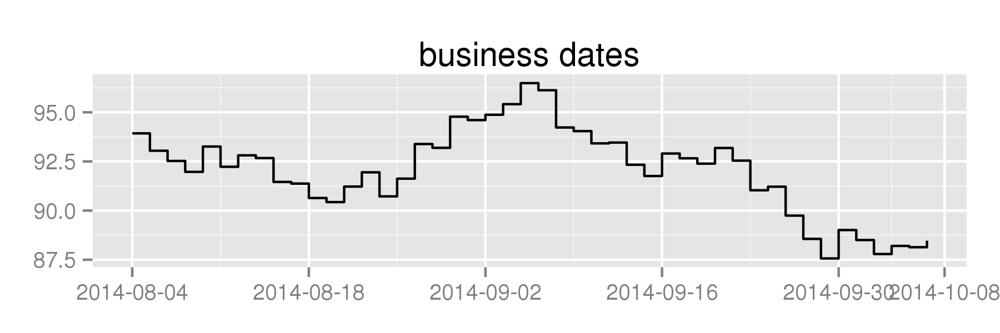

bdscale
========

Remove weekends and holidays from `ggplot2` axes.

### Get some dates

We need to know which days are valid trading days. Can ask Yahoo Finance for past NYSE trading days:

```
nyse <- bdscale::get_nyse()
```

### Plot on standard calendar-day axis:

Create some fake prices, put them into a `data.frame` alongside the dates, and plot:

```
set.seed(12345)
df <- data.frame(date=nyse, price=cumsum(rnorm(length(nyse))) + 100)

library(dplyr)
library(ggplot2)

df %>% filter(as.Date('2014-08-01') < date & date < as.Date('2014-10-08')) %>% 
  ggplot(aes(x=date, y=price)) + geom_step() + 
  ggtitle('calendar dates')

```

This yields a graph with a large gap at the beginning of September, because Labor Day was on the 1st:


### Plot on a business-day axis:

If instead you plot against `scale_x_bd`:

```
df %>% filter(as.Date('2014-08-01') < date & date < as.Date('2014-10-08')) %>% 
  ggplot(aes(x=date, y=price)) + geom_step() + bdscale::scale_x_bd(business.dates=nyse) +
  ggtitle('business dates')
```

You'll remove weekends and holidays from the graph:


