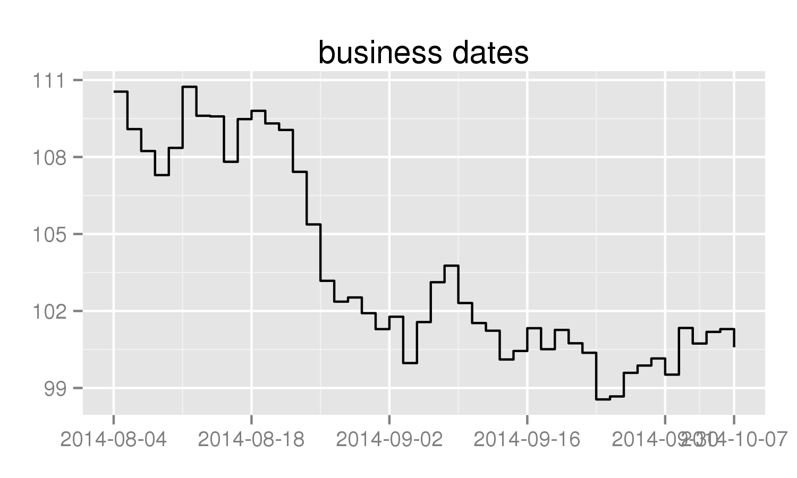
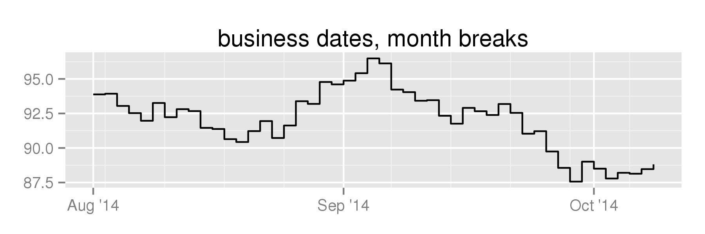
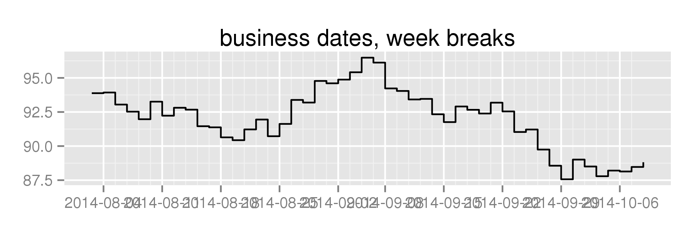
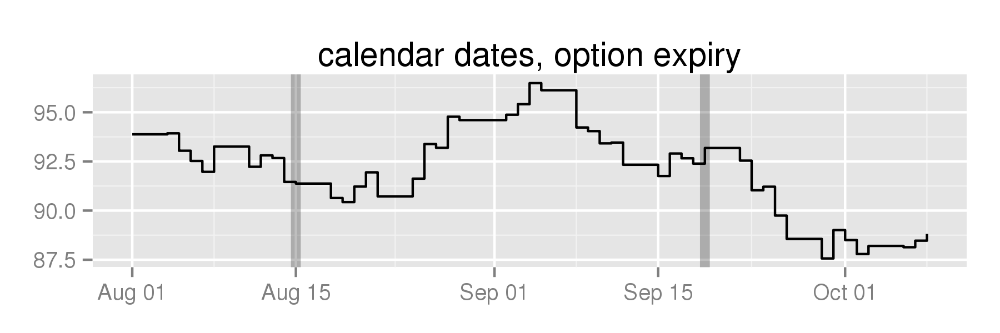
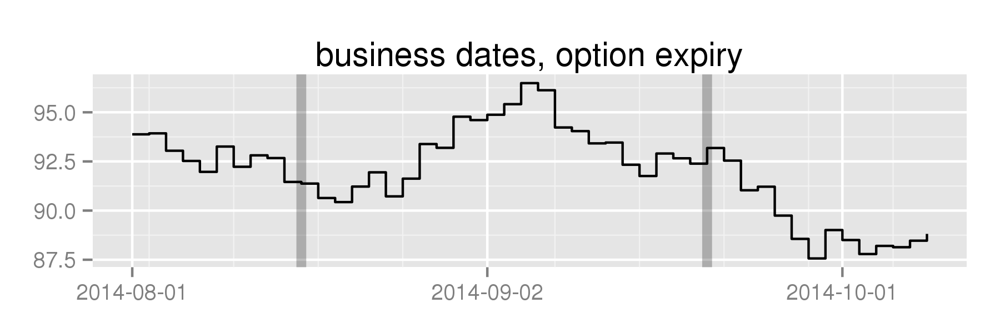

bdscale
========

Remove Weekends and Holidays From `ggplot2` Axes [](https://travis-ci.org/dvmlls/bdscale)

### Find valid dates

Ask Yahoo Finance for S&P prices, use those as past NYSE trading dates. Then create some fake prices, put them into a `data.frame` alongside the dates:

```
nyse <- yahoo()
set.seed(12345)
df <- data.frame(date=nyse, price=cumsum(rnorm(length(nyse))) + 100)
```

### Plot on standard calendar-day axis:

Create a plot:

```
library(dplyr)
library(ggplot2)

plot <- df %>% filter(as.Date('2014-08-01') <= date & date <= as.Date('2014-10-08')) %>% 
  ggplot(aes(x=date, y=price)) + geom_step() + 
  theme(axis.title.x=element_blank(), axis.title.y=element_blank())
  
plot + ggtitle('calendar dates')

```

Note the large gap at the beginning of September, because Labor Day was on the 1st:



### Plot on a business-day axis:

Plot against `scale_x_bd` instead:

```
plot + scale_x_bd(business.dates=nyse, labels=date_format("%b '%y")) + 
  ggtitle('business dates, month breaks')
```

Removes weekends and holidays from the graph:



The major breaks are pretty far apart, on the first trading day of each month. 

It's a wide chart, tell it to use more breaks:

```
plot + scale_x_bd(business.dates=nyse, max.major.breaks=10, labels=date_format('%b %d')) + 
  ggtitle('business dates, week breaks')
```

Given that max, it determines it can put major breaks on the first trading day of the week, and minor breaks every day:



### Translating into business-day space

Say I wanted to put vertical lines on option expiration dates. 

Calling `as.numeric` on my dates translates them into the the number of calendar days after the unix epoch, which is what `scale_x_date` uses (see `scales:::from_date`):

```
options <- c('2014-08-15', '2014-09-19') %>% as.Date

plot + 
  geom_vline(xintercept=as.numeric(options), size=2, alpha=0.25) + 
  ggtitle('calendar dates, option expiry')
````



This doesn't work for business-day space because the x-axis now represents the number of business days after the first date in your `business.dates` vector. 

Instead, use the `bdscale::bd2t` function to translate into business-day space:

```
plot + 
  geom_vline(xintercept=bd2t(options, business.dates=nyse), size=2, alpha=0.25) + 
  scale_x_bd(business.dates=nyse) +
  ggtitle('business dates, option expiry')
```


