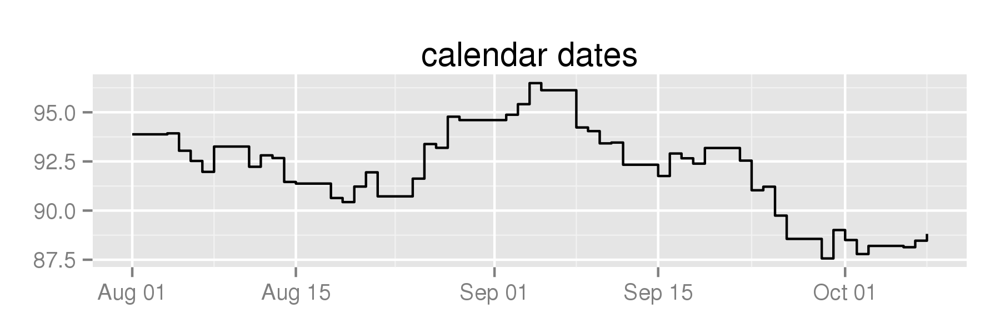

bdscale
========

Remove weekends and holidays from `ggplot2` axes.

### Get some dates

We need to know which days are valid trading days. Can ask Yahoo Finance for past NYSE trading days:

```
nyse <- bdscale::get_nyse()
```

### Pair with a random walk

Now, create some fake prices and data-frame them:

```
set.seed(12345)
df <- data.frame(date=nyse, price=cumsum(rnorm(length(nyse))) + 100)
```

### Plot on standard calendar-day axis:

Plotting this like so:

```
library(dplyr)
library(ggplot2)

df %>% filter(as.Date('2014-08-01') < date & date < as.Date('2014-10-08')) %>% 
  ggplot(aes(x=date, y=price)) + geom_step() + 
  ggtitle('calendar dates')

```

Yields the following graph. Note the extended portions over weekends:



### Plot on a business-day axis:

If you plot against `scale_x_bd` like so:

```
df %>% filter(as.Date('2014-08-01') < date & date < as.Date('2014-10-08')) %>% 
  ggplot(aes(x=date, y=price)) + geom_step() + bdscale::scale_x_bd(business.dates=nyse) +
  ggtitle('business dates')
```

You'll remove weekends and holidays from the graph:


